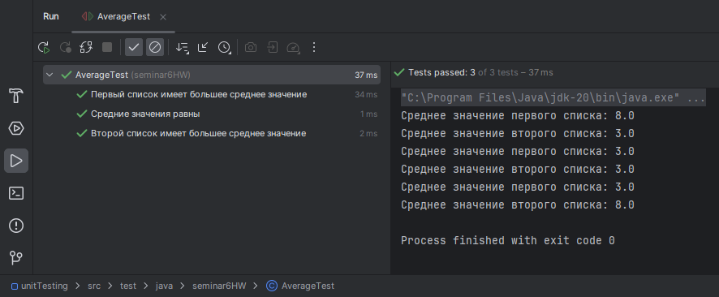
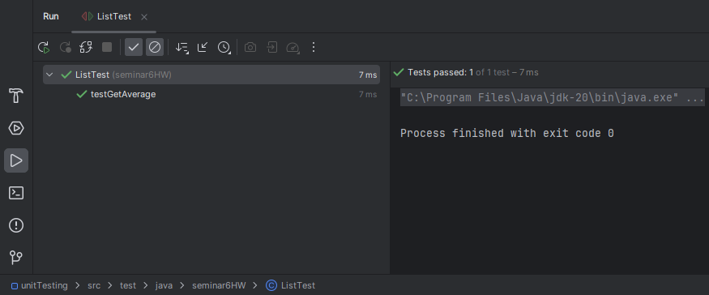
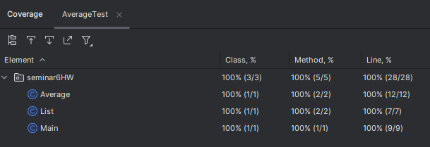

## Домашнее задание №6. Юнит тестирование в других языках ##

Задание. Создайте программу на Python или Java, которая принимает два списка чисел и выполняет следующие действия:
1. Рассчитывает среднее значение каждого списка.
2. Сравнивает эти средние значения и выводит соответствующее сообщение:
- "Первый список имеет большее среднее значение", если среднее значение первого списка больше.
- "Второй список имеет большее среднее значение", если среднее значение второго списка больше.
- "Средние значения равны", если средние значения списков равны.

Важно:\
Приложение должно быть написано в соответствии с принципами объектно-ориентированного программирования.
Используйте Pytest (для Python) или JUnit (для Java) для написания тестов, которые проверяют правильность работы программы. Тесты должны учитывать различные сценарии использования вашего приложения.
Используйте pylint (для Python) или Checkstyle (для Java) для проверки качества кода.
Сгенерируйте отчет о покрытии кода тестами. Ваша цель - достичь минимум 90% покрытия.

Формат и требования к сдаче:\
Отчет о выполнении этого задания должен включать в себя следующие элементы:
- Код программы
- Код тестов
- Отчет pylint/Checkstyle
- Отчет о покрытии тестами
- Объяснение того, какие сценарии покрыты тестами и почему вы выбрали именно эти сценарии.

## Отчет о выполнении задания ##

1. Код программы\
Код программы представлен в папке src - main - java - seminar6HW.\
Описание программы:\
Программа состоит из метода Main и классов Average и List.\
В методе Main создаются два списка чисел и объекты класса List для каждого списка. Затем создается объект класса Average, который принимает два объекта класса List. Вызывается метод compareAverages(), который вычисляет средние значения для каждого списка, сравнивает их и выводит соответствующее сообщение.\
Класс List содержит список чисел и метод для вычисления среднего значения списка.\
Класс Average содержит два объекта класса List, метод для сравнения средних значений и метод для вывода сообщения о результатах сравнения.

2. Код тестов\
Коды тестов представлены в папке src - test - java - seminar6HW.

3. Отчет Checkstyle

Отчет Checkstyle по AverageTest\

Отчет Checkstyle по ListTest\

4. Отчет о покрытии тестами

Отчет о покрытии тестами Coverage\

5. Объяснение того, какие сценарии покрыты тестами и почему вы выбрали именно эти сценарии.
* AverageTest включает тесты для проверки корректности вычисления среднего значения двух списков чисел:\
-- первый список имеет большее среднее значение;\
-- второй список имеет большее среднее значение;\
-- средние значения двух списков равны.\
* ListTest включает тест на получение среднего значения списка и на получение среднего значения пустого списка (закомментирован).